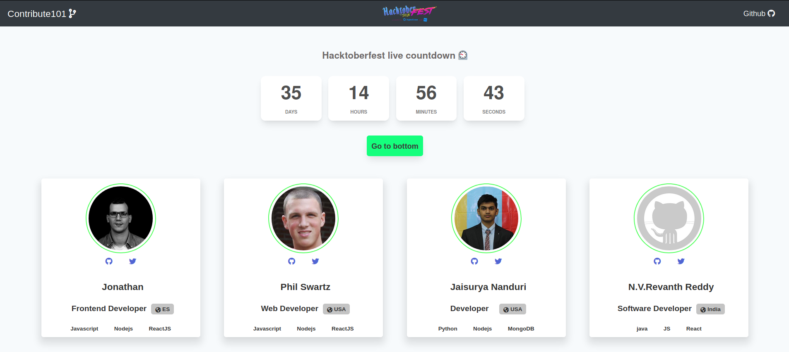

<h1 align="center">
  ✨Contribute101
</h1>
<p align="center"> 

<h4 align="center">✨ Hacktoberfest 2020 has started ! Start contributing 🚀🎉</h4>
</p>

<!-- > ### ✨ Hacktoberfest 2019 has ended ! See you in 2020 🚀🎉 -->

> ✨ Contributors that want to work on additional features on this project . Please follow this guideline :point_right: [Here](https://github.com/RocktimSaikia/Contribute-101/blob/master/contributors-guide.md)



---

<br><br>

## :cloud: Introduction:

Contribution to Open Source Projects is a great way to enhanching your coding skills and along with expanding your knowledge on the new technologies. But top of that contributing to Open Source Projects is FUN.The joy of the first time when your pull request gets accepted is amazing. Which you are going to find today by contributing to this project.

<br><br>

## :hammer: Prerequisite :

- install [nodejs](https://nodejs.org) on your local machine globally.

<br><br>

## :sparkles: Steps :

1. Fork this repository and clone it to your computer

2. Install the dependencies locally

```bash
npm install
```

3. Now create a new remote branch with any name you want

```bash
git checkout -b "myCard"
```

4. Now go to `contributors/index.js` file and add your details.

5. Run this command to check for any remaining typos and style errors

```bash
npm run lint:fix
```

5. Push your local changes that you have made

```bash
git add .
git commit -m "Add YOURNAME's card"
git push -u origin myCard
```

---

<br><br>

### Congrats :tada: .You have successfully created your pull request. Now wait for the review and merge.
