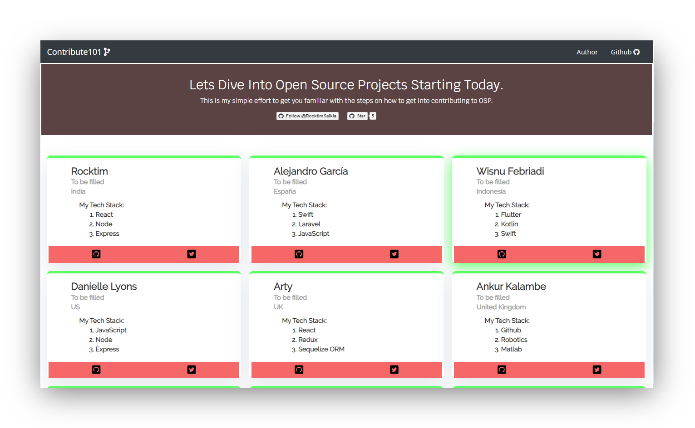
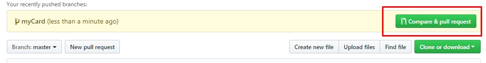

<h1 align="center">
  ✨Contribute101
</h1>

 

> ✨ Contribute and get a step forward in completing the Hacktoberfest 2019.

;

---

### Introduction:

Contribution to Open Source Projects is a great way to enhanching your coding skills and along with expanding your knowledge on the new technologies. But top of that contributing to Open Source Projects is FUN.The joy of the first time when your pull request gets accepted is amazing. Which you are going to find today by contributing to this project.

### What we are gonna do :

So in this project you are going to create a bootstrap card of yourself by filling up some given things which we will talk later.
But for now lets get straight into work.

> #### contributors that want to work on additional feature on this project . Please follow this guideline :point_right: [Here](https://github.com/RocktimSaikia/Contribute-101/blob/master/contributors-guide.md)

### Prerequisite :

- install [nodejs](https://nodejs.org) on your local machine globally.

## Steps :

1. Fork this repo.

---

2. Clone your forked repo on anywhere on your laptop/computer .And how we do that :

- On your forked repo, Click here

- Copy the url of your forked repo

- Now run this command
  `git clone URL`

  

---

3. Now go that project folder and open it with your favorite IDE. I am using [Visual Studio Code](https://code.visualstudio.com) for this project.

- Currently the file structure would look like this.

- Now go to _contributors_/ _index.js_ file.
- Then add your details with given object model.

;

4. Now create a new remote branch and push our modified remote repo to our github repo :
   - `git checkout -b <BranchName>` [ex : `git checkout -b myCard`]
     
   - `git add .`[don't forget the dot `'.'` in the end]
   - `git commit -m "Add YOURNAME's card"`[ex: git commit -m "Rocktim's card"]
   - `git push -u origin <Branchname>` [ex : `git push -u origin myCard`]
   - **DONE HERE ,Lets go to our github repo of this project**

---

5. Now you should see this button .Just click on this button.After that dont chnage anything and just create a pull request. **And We are done. Pheeewwwww!!!**
   

---

---

### \*After creating a successful pull request when you will go to github home page you should see your pull request on the up front. And as soon as i merge your code after reviewing it to my repo you will recieve an email from github and that pull request menu would be gone from your github's homepage. Enjoy then, You made your first open source contribution .
